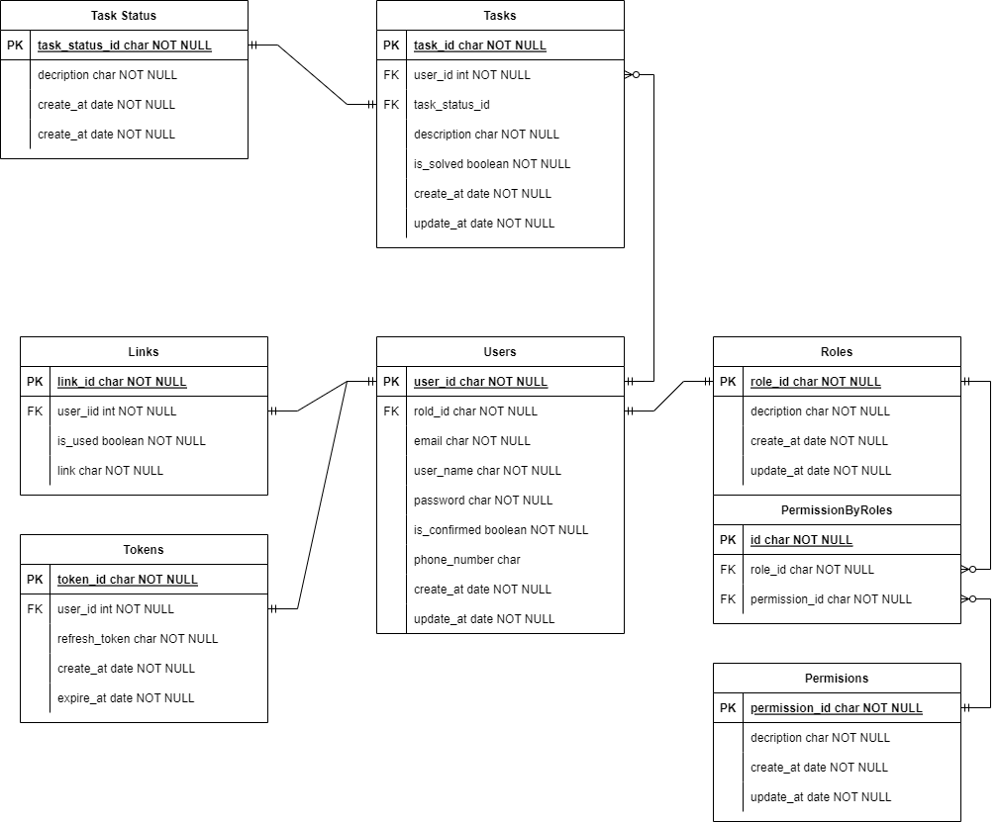
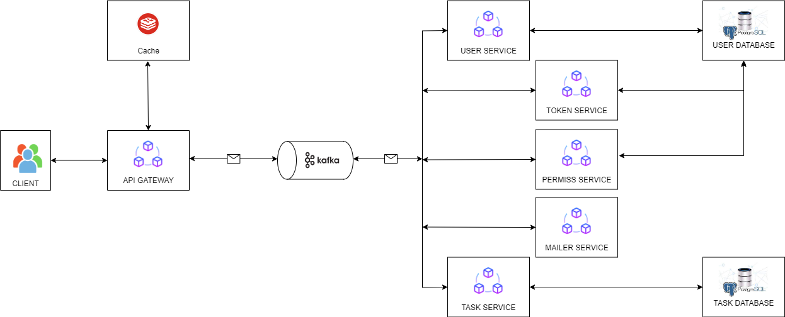

# This repository help me build APIs with microservice architecture using nestjs

# Requirements:
1. Basic design patterns: DI, IoC, MVC, Singleton, Repository, Service, ORM
2. Applying design principles: SOLID, DDD
3. Basic tools: Docker, Gitlab CI
4. Understand the role of each service in the microservice system
5. Third parties: Database, Cache, Message-Broker, Elasticsearch, Socket,….
# Entity Relationship Diagram

# Brief architecture overview
    + API gateway
    + Token service - responsible for creating, decoding, destroying JWT tokens for users
    + User service - responsible for CRUD operations on users
    + Mailer service - responsible for sending out emails (confirm sign up)
    + Permission service - responsible for verifying permissions for logged in users.
    + Tasks service - responsible for CRUD operations on users tasks records
    + Third Parties:
        + The service interact via Kafka
        + Using redis as caching
        + Using PostgreSQL as Database
